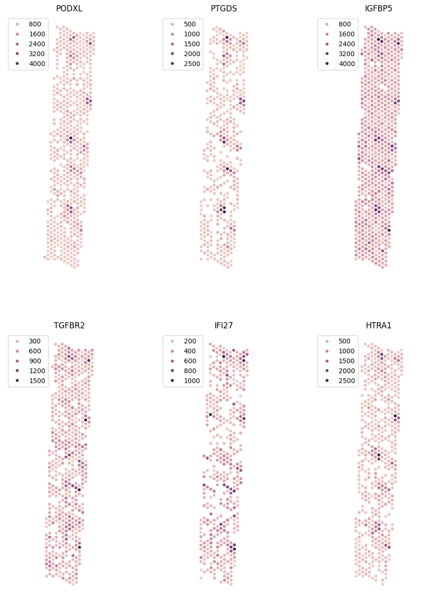
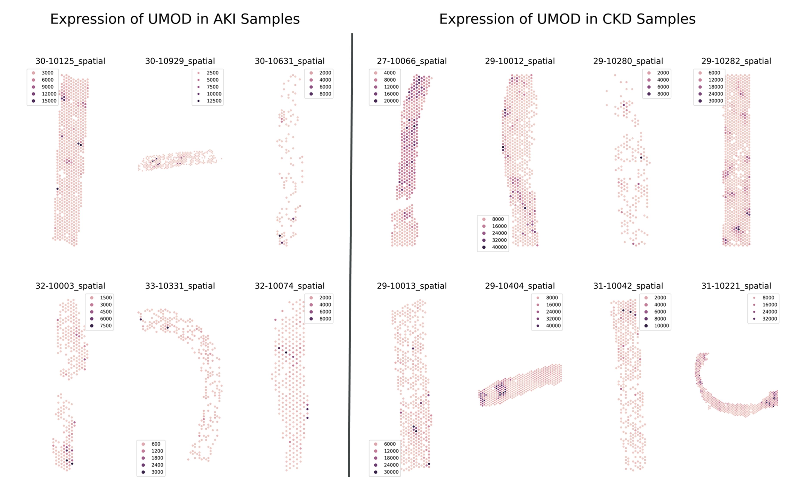

 

# PersiST

PersiST is an exploratory method for analysing spatial transcriptomics (and other spatial 'omics) datsets. Given a spatial transcriptomics data set containing expression data on multiple genes, resolved to a shared set of co-ordinates (for example, Visium type spatial transcriptomics data), PersiST computes a single score for each gene that measures the amount of spatial structure that gene shows in it's expression pattern, called the *Coefficient of Spatial Structure* (CoSS). This score can be used for multiple analytical tasks, as we show below.

# Installation

PersiST can be installed using pip:

```python3 -m pip install persist_spatial``` 

# Documentation 

PersiST's documentation can be found [https://persist-spatial.readthedocs.io/en/latest/](here).

# Tutorial

## Spatially Variable Gene Identification

For this tutorial, we shall be looking at a Visium type spatial transcriptomics data on a sample from the Kidney Precision Medicine Project[1]. 


```python
import pandas as pd
df = pd.read_csv('data/kpmp_30-10125_spatial_expression.csv')
df.head()
```


<div>
<table border="1" class="dataframe">
  <thead>
    <tr style="text-align: right;">
      <th></th>
      <th>x_position</th>
      <th>y_position</th>
      <th>TSPAN6</th>
      <th>TNMD</th>
      <th>DPM1</th>
      <th>SCYL3</th>
      <th>C1orf112</th>
      <th>FGR</th>
      <th>CFH</th>
      <th>FUCA2</th>
      <th>...</th>
      <th>ENSG00000288156</th>
      <th>ENSG00000288162</th>
      <th>ENSG00000288172</th>
      <th>ENSG00000288187</th>
      <th>ENSG00000288234</th>
      <th>ENSG00000288253</th>
      <th>ENSG00000288302</th>
      <th>ENSG00000288380</th>
      <th>ENSG00000288398</th>
      <th>SOD2</th>
    </tr>
  </thead>
  <tbody>
    <tr>
      <th>0</th>
      <td>0.548810</td>
      <td>0.834208</td>
      <td>0.00000</td>
      <td>0.0</td>
      <td>0.000000</td>
      <td>0.0</td>
      <td>0.00000</td>
      <td>117.633220</td>
      <td>0.00000</td>
      <td>0.00000</td>
      <td>...</td>
      <td>0.0</td>
      <td>0.0</td>
      <td>0.0</td>
      <td>0.0</td>
      <td>0.0</td>
      <td>0.0</td>
      <td>0.0</td>
      <td>0.0</td>
      <td>0.0</td>
      <td>1058.6990</td>
    </tr>
    <tr>
      <th>1</th>
      <td>0.589610</td>
      <td>0.809106</td>
      <td>0.00000</td>
      <td>0.0</td>
      <td>0.000000</td>
      <td>0.0</td>
      <td>0.00000</td>
      <td>86.865880</td>
      <td>173.73177</td>
      <td>86.86588</td>
      <td>...</td>
      <td>0.0</td>
      <td>0.0</td>
      <td>0.0</td>
      <td>0.0</td>
      <td>0.0</td>
      <td>0.0</td>
      <td>0.0</td>
      <td>0.0</td>
      <td>0.0</td>
      <td>1737.3176</td>
    </tr>
    <tr>
      <th>2</th>
      <td>0.571644</td>
      <td>0.166174</td>
      <td>75.90709</td>
      <td>0.0</td>
      <td>75.907090</td>
      <td>0.0</td>
      <td>0.00000</td>
      <td>0.000000</td>
      <td>151.81418</td>
      <td>0.00000</td>
      <td>...</td>
      <td>0.0</td>
      <td>0.0</td>
      <td>0.0</td>
      <td>0.0</td>
      <td>0.0</td>
      <td>0.0</td>
      <td>0.0</td>
      <td>0.0</td>
      <td>0.0</td>
      <td>2201.3057</td>
    </tr>
    <tr>
      <th>3</th>
      <td>0.539074</td>
      <td>0.714422</td>
      <td>382.89725</td>
      <td>0.0</td>
      <td>127.632416</td>
      <td>0.0</td>
      <td>0.00000</td>
      <td>127.632416</td>
      <td>0.00000</td>
      <td>0.00000</td>
      <td>...</td>
      <td>0.0</td>
      <td>0.0</td>
      <td>0.0</td>
      <td>0.0</td>
      <td>0.0</td>
      <td>0.0</td>
      <td>0.0</td>
      <td>0.0</td>
      <td>0.0</td>
      <td>1148.6918</td>
    </tr>
    <tr>
      <th>4</th>
      <td>0.570493</td>
      <td>0.468741</td>
      <td>82.88438</td>
      <td>0.0</td>
      <td>0.000000</td>
      <td>0.0</td>
      <td>82.88438</td>
      <td>0.000000</td>
      <td>82.88438</td>
      <td>0.00000</td>
      <td>...</td>
      <td>0.0</td>
      <td>0.0</td>
      <td>0.0</td>
      <td>0.0</td>
      <td>0.0</td>
      <td>0.0</td>
      <td>0.0</td>
      <td>0.0</td>
      <td>0.0</td>
      <td>1989.2250</td>
    </tr>
  </tbody>
</table>
<p>5 rows × 26026 columns</p>
</div>


This is a pandas DataFrame where the first two columns correspond to the well co-ordinates, and the remaining columns contain the expression of each gene in each well (in this case measured in counts per million). This is the format PersiST expects spatial transcriptomics data to come in.

We can compute CoSS values for all the genes in this sample using the function `run_persistence()`, which takes as input a data frame like the above. This should take about 10 - 20 minutes, depending on the system you are running this on.


```python
from persist_spatial.compute_persistence import run_persistence
metrics = run_persistence(df)
```

The CoSS is a measure of the amount of spatial structure in a gene's expression pattern. Let's take a look at those genes with the highest CoSS scores:


```python
metrics = metrics.sort_values('CoSS', ascending=False)
metrics.iloc[:10,:]
```


<div>
<table border="1" class="dataframe">
  <thead>
    <tr style="text-align: right;">
      <th></th>
      <th>gene</th>
      <th>CoSS</th>
      <th>ratio</th>
      <th>gene_rank</th>
      <th>possible_artefact</th>
      <th>svg</th>
    </tr>
  </thead>
  <tbody>
    <tr>
      <th>16443</th>
      <td>IGLC1</td>
      <td>0.141620</td>
      <td>0.651803</td>
      <td>1.0</td>
      <td>No</td>
      <td>Yes</td>
    </tr>
    <tr>
      <th>16483</th>
      <td>IGHG1</td>
      <td>0.114255</td>
      <td>0.467722</td>
      <td>2.0</td>
      <td>No</td>
      <td>Yes</td>
    </tr>
    <tr>
      <th>5372</th>
      <td>MT1G</td>
      <td>0.105850</td>
      <td>0.335738</td>
      <td>3.0</td>
      <td>No</td>
      <td>Yes</td>
    </tr>
    <tr>
      <th>10798</th>
      <td>DEFB1</td>
      <td>0.103534</td>
      <td>0.376595</td>
      <td>4.0</td>
      <td>No</td>
      <td>Yes</td>
    </tr>
    <tr>
      <th>12467</th>
      <td>CCL19</td>
      <td>0.101025</td>
      <td>0.649770</td>
      <td>5.0</td>
      <td>No</td>
      <td>Yes</td>
    </tr>
    <tr>
      <th>22516</th>
      <td>C17orf113</td>
      <td>0.098336</td>
      <td>0.574433</td>
      <td>6.0</td>
      <td>No</td>
      <td>Yes</td>
    </tr>
    <tr>
      <th>6980</th>
      <td>ALDOB</td>
      <td>0.096201</td>
      <td>0.271491</td>
      <td>7.0</td>
      <td>No</td>
      <td>Yes</td>
    </tr>
    <tr>
      <th>5750</th>
      <td>PODXL</td>
      <td>0.095475</td>
      <td>0.327815</td>
      <td>8.0</td>
      <td>No</td>
      <td>Yes</td>
    </tr>
    <tr>
      <th>1102</th>
      <td>SLC12A3</td>
      <td>0.095306</td>
      <td>0.352575</td>
      <td>9.0</td>
      <td>No</td>
      <td>Yes</td>
    </tr>
    <tr>
      <th>11812</th>
      <td>UMOD</td>
      <td>0.094709</td>
      <td>0.401716</td>
      <td>10.0</td>
      <td>No</td>
      <td>Yes</td>
    </tr>
  </tbody>
</table>
</div>


PersiST outputs a number of quantities for each gene:

- **CoSS**: The Coefficient of Spatial Structure, a continuous quantity that can serve as a proxy for the amount of spatial structure in a gene's expression.
- **Ratio**: Roughly, this measures how much of a gene's CoSS is down to a single spatial features. Genes with a high ratio may be techinical artefacts, see [2] for details.
- **gene_rank**: The rank of each gene, where gene's are ranked from highest to lowest CoSS (so a rank of 1 is give to the gene with the highest CoSS).
- **possible_artefact**: Based on the ratio, PersiST automatically flags genes as possible artefacts [2]. We emphasise that this is only a suggestion, manual inspection should be performed before dismissing any genes.
- **svg**: Based on the CoSS scores, PersiST automatically calls genes as spatially variable or not [2].

We can plot the expression of those genes for which the CoSS is highest using the function `plot_many_genes()`, to which we need to provide a dataframe containing spatial expression data, and a list of genes to plot. 


```python
from persist_spatial.plotting_utils import plot_many_genes
plot_many_genes(df, list(metrics.gene)[:20])
```


We can see that PersiST effectively surfaces those genes with notable spatial structure.

From the CoSS scores PersiST automatically calles genes as spatially variable or not (this is the 'svg' column in the results). This provides a triaged list of genes that can be selected for further analysis. 

For example, one can search for genes with spatially similar expression patterns. Reduction to the comparatively small number of genes PersiST typically calls as SV makes this task much easier; in our experience simple clustering methods, such as hierarchical clustering, were effective to pick out groups of SVGs with co-localised expression.

For example, we plot group of genes all expressed in the glomeruli of this particular sample [2]. This group was obtained by running simple hierarchichal clustering on the list of SVGs identified by PersiST and manually inspecting the results.


```python
plot_many_genes(df, ['PODXL', 'PTGDS', 'IGFBP5', 'TGFBR2', 'IFI27', 'HTRA1'], numcols=3)
```



## Differential Spatial Expression Testing

If you are working with multiple spatial transcriptomics samples, and there are defined subgroups present within these samples, the CoSS scores can be used to look for genes that display difference in their spatial pattern of expression between the subgroups.

In the KPMP dataset, there are Acute Kidney Infection (AKI) and Chronic Kidney Disease (CKD) samples. For each gene, we computed the average CoSS score within the AKI and CKD samples. The gene with the highest different between the two was UMOD. Below we plot the expression of UMOD in all the kpmp samples.



In the AKI samples, UMOD displays well-defined regions of higher expression, whereas in the CKD samples the expression of UMOD is much more diffuse. 

UMOD is a marker gene for tubles, a key structural component of the kidney. It is plausible that this difference in expression between the AKI and CKD samples reflects the structural breakdown that is chracteristic of progressed kidney disease. Using PersiST, we are able to automatically detect and quantify this structural breakdown.

## References

[1] Blue B Lake et al. “An atlas of healthy and injured cell states and niches in the human kidney”. In: Nature
619.7970 (2023), pp. 585–594.

[2] PersiST paper (not yet published)
